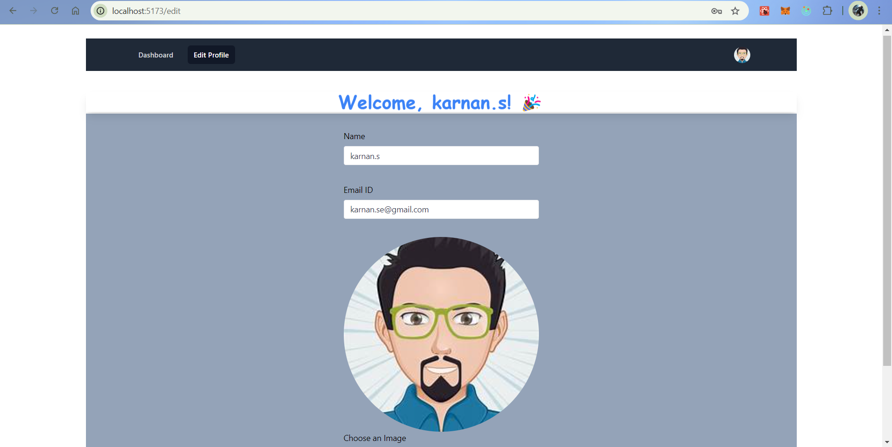

# Simple CRUD Operations

## BACKEND

<div style="padding: 10px; font-size: 16px; background-color: #f5f5f5; border-radius: 5px;">

```json
{
  "RuntimeEnvironment": "Node.js",
  "Framework": "Express.js",
  "Authentication": "JWT Token",
  "APIType": "REST API",
  "Architecture": "MVC",
  "Database": "MongoDB",
  "FileHandling": "Multer"
}


```
</div>

## FrontEnd
<div style="padding: 10px; font-size: 16px; background-color: #f5f5f5; border-radius: 5px;">

```json

{
    "FRAMEWORk" : "VITE",
    "LIBRARY": "REACT , REDUX",
    "DATA FETCHING":"RTK QUERY",
    
}
```
</div>

"Explore the code for structured authentication and seamless API integration, built in line with the latest industry standards and trends. RTK Query enhances the experience with its unique features, including automatic data fetching and caching, ensuring optimal performance and efficiency."

## Login Page
The login page allows users to authenticate with their credentials. JWT tokens are generated upon successful login to maintain session management.


## Dashboard

The dashboard provides an overview of user activities and accessible features. It ensures smooth navigation across different sections of the application.


## JWT Token
This section showcases how JWT tokens are created and utilized to authenticate API requests, ensuring secure access to resources.


## Edit Page with Validation  
The edit page allows users to modify existing data with real-time validation. Input fields are checked for correctness, ensuring only valid data is submitted. Error messages are displayed dynamically for invalid inputs, guiding users to make corrections before saving changes.



